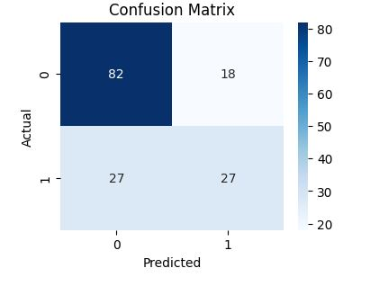

# 🩺 Predicting Diabetes Using Logistic Regression, Random Forest, and XGBoost

**Author:** [Suraj Kumar Kamble](https://github.com/Surajkumar123-commits)  
**Role:** Senior Analyst | AI & GenAI Specialist  
**Tech Stack:** Python • FastAPI • Scikit-Learn • XGBoost • Pandas • NumPy • Joblib • Uvicorn • Jupyter • Git/GitHub  

---

## 🎯 Project Overview

This project builds a **machine learning pipeline** to predict diabetes using three algorithms:
- Logistic Regression  
- Random Forest  
- XGBoost  

The project includes:
- 📊 Exploratory Data Analysis (EDA)
- 🧹 Data Cleaning & Feature Scaling
- 🤖 Model Training, Evaluation, and Comparison
- 🌐 FastAPI endpoint for real-time prediction

---

## 🧠 Tech Architecture

```text
 ┌──────────────────────────┐
 │  Dataset (CSV - Kaggle) │
 └──────────────┬───────────┘
                │
                ▼
 ┌──────────────────────────┐
 │  Jupyter Notebooks       │  → EDA, Cleaning, Modeling
 └──────────────┬───────────┘
                │
                ▼
 ┌──────────────────────────┐
 │  Trained Models (.pkl)   │  → Logistic, RF, XGB
 └──────────────┬───────────┘
                │
                ▼
 ┌──────────────────────────┐
 │  FastAPI Application     │  → API endpoints (/predict)
 └──────────────┬───────────┘
                │
                ▼
 ┌──────────────────────────┐
 │  Predictions + Prob.     │  → JSON output (0 or 1)
 └──────────────────────────┘

 # Folder Structure

 diabetes-prediction/
│
├── data/
│   └── diabetes.csv
│
├── notebooks/
│   ├── 01_Environment_Check.ipynb
│   ├── 02_EDA.ipynb
│   └── 03_Model_Building.ipynb
│
├── models/
│   ├── logistic_regression_model.pkl
│   ├── random_forest_model.pkl
│   ├── xgboost_model.json
│   └── scaler.pkl
│
├── app/
│   ├── api.py
│   └── utils.py
│
├── README.md
├── requirements.txt
└── .gitignore

🚀 How to Run Locally
1️⃣ Clone the Repository
git clone https://github.com/Surajkumar123-commits/diabetes-prediction.git
cd diabetes-prediction

2️⃣ Create and Activate Virtual Environment
python -m venv .venv
.\.venv\Scripts\activate   # On Windows

3️⃣ Install Dependencies
pip install -r requirements.txt

4️⃣ Run FastAPI Server
uvicorn app.api:app --reload

👉 Visit: http://127.0.0.1:8000

Swagger UI: http://127.0.0.1:8000/docs

API Usage Example

Endpoint: POST /predict

Request Body (JSON):
{
  "Pregnancies": 2,
  "Glucose": 120,
  "BloodPressure": 70,
  "SkinThickness": 25,
  "Insulin": 80,
  "BMI": 28.5,
  "DiabetesPedigreeFunction": 0.45,
  "Age": 35,
  "model_choice": "xgboost"
}
Response:
{
  "model_used": "xgboost",
  "prediction": 1,
  "label": "Diabetic",
  "probability": 0.87
}

📈 Model Comparison Summary
| Model               | Accuracy | ROC-AUC | F1-Score |
| ------------------- | -------- | ------- | -------- |
| Logistic Regression | 0.79     | 0.82    | 0.77     |
| Random Forest       | 0.84     | 0.87    | 0.83     |
| XGBoost             | 0.86     | 0.90    | 0.85     |

✅ Best Model: XGBoost (highest accuracy and ROC-AUC)

### 📊 Visual Outputs




🔮 Future Enhancements

Deploy via Render / HuggingFace Spaces

Integrate Streamlit Dashboard

Add Model Retraining Pipeline

Enable Docker Deployment

🧩 License

This project is open-sourced under the MIT License.

### 👨‍💻 Author  

**SurajKumar Madhukar Kamble**  
📍 Pune, India  
💼 Senior Analyst | AI & GenAI Specialist  
🔗 [GitHub](https://github.com/Surajkumar123-commits)
